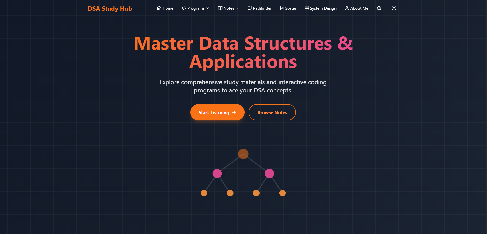
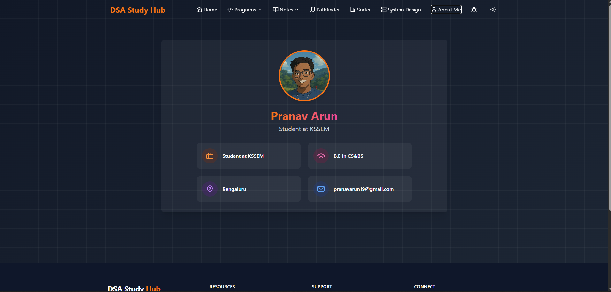
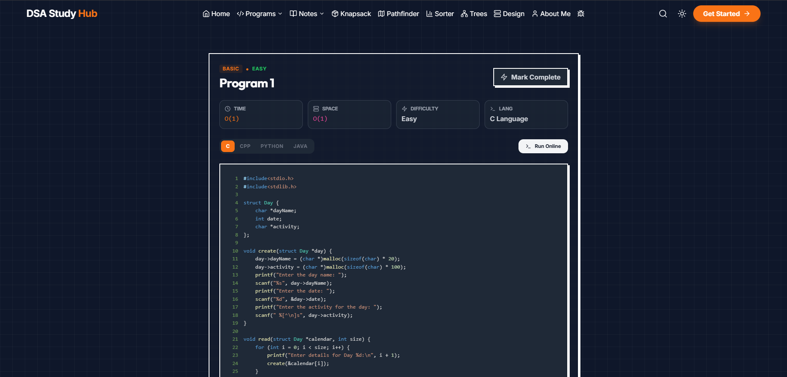
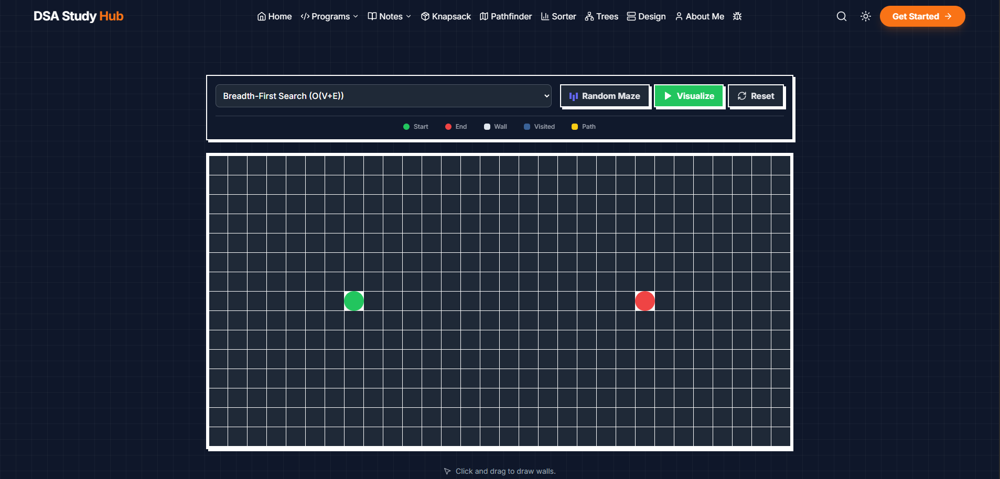
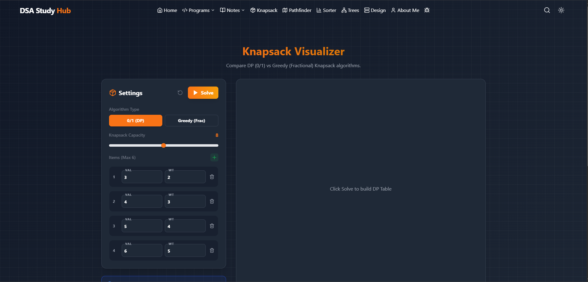
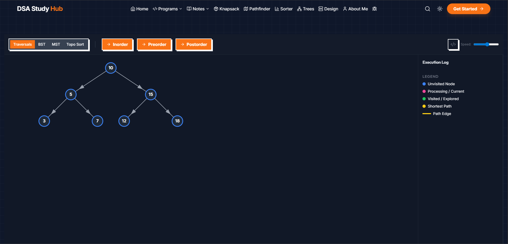
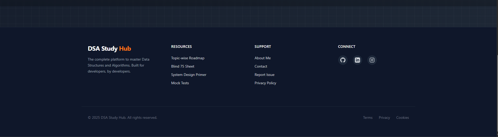

# 📚 DSA Study Hub

**Live Demo:** [https://dsa-study-hub.vercel.app/](https://dsa-study-hub.vercel.app/)

**DSA Study Hub** is an interactive educational web application designed to help students master **Data Structures and Applications (DSA)**. It features a modern, responsive interface where users can view C source code for standard laboratory programs and run interactive simulations of those algorithms directly in the browser.


## 📸 Project Previews

### Landing Page



### About Me Section

An integrated portfolio section to showcase My details.


### Interactive Program Simulator

View C code and run simulations (like Stack Operations) instantly.


### Path Finder Visualizer

Interactive Path Finder


### Knapsack Visualizer

Dynamic Programming Visualization for Knapsack Problem


### Trees & Graphs

Visualizing Tree Traversals and Graph Algorithms


### System Design in DSA

System Design for DSA


### Footer

Contact and Social Links



## 🚀 Features

- **Interactive Program Simulators:** Visualize and interact with algorithms logic (e.g., Stack operations, Graph traversals) without needing a C compiler.
- **Code Repository:** Access full, copy-ready C source code for 12+ standard DSA programs.
- **Modern UI/UX:**
  - **Dark/Light Mode** toggle for comfortable reading.
  - **Responsive Design** using Tailwind CSS.
  - **Copy-to-Clipboard** functionality for all code snippets.
- **Portfolio Section:** Integrated "About Me" section for instructor/student details.

## 🛠️ Tech Stack

- **Frontend Framework:** [React](https://reactjs.org/) (v18+)
- **Language:** [TypeScript](https://www.typescriptlang.org/)
- **Build Tool:** [Vite](https://vitejs.dev/)
- **Styling:** [Tailwind CSS](https://tailwindcss.com/)
- **Icons:** [Lucide React](https://lucide.dev/)

## 📂 Included Programs

The application includes simulations and source code for the following topics:

1. **Weekly Calendar:** Struct usage and dynamic memory allocation.
2. **String Operations:** Pattern matching and replacement.
3. **Stack Operations:** Push, pop, and palindrome check.
4. **Expression Conversion:** Infix to Postfix conversion.
5. **Recursion:**
    - **5A:** Postfix Evaluation.
    - **5B:** Tower of Hanoi.
6. **Circular Queue:** Array-based implementation.
7. **Singly Linked List (SLL):** Student data management.
8. **Doubly Linked List (DLL):** _(Placeholder)_.
9. **Polynomials:** Addition and evaluation using Linked Lists.
10. **Binary Search Tree (BST):** Creation, traversal (Inorder/Preorder/Postorder), and search.
11. **Graph Algorithms:** BFS (Breadth-First Search) and DFS (Depth-First Search).
12. **Hashing:** Hash table implementation with linear probing.

## ⚡ Getting Started

Follow these steps to run the project locally on your machine.

### Prerequisites

- [Node.js](https://nodejs.org/) (v16 or higher)
- npm (Node Package Manager)

### Installation

1. **Clone the repository:**

    ```bash
    git clone [https://github.com/yourusername/dsa-study-hub.git](https://github.com/yourusername/dsa-study-hub.git)
    cd dsa-study-hub
    ```

2. **Install dependencies:**

    ```bash
    npm install
    ```

3. **Run the development server:**

    ```bash
    npm run dev
    ```

4. **Open in Browser:**
    Click the link shown in the terminal (usually `http://localhost:5173`) to view the app.


## 🔮 Future Enhancements

We have exciting plans to enhance DSA Study Hub with the following features:

### Enhanced Learning Features

- **Code Playground:** In-browser C/C++ compiler for live code testing
- **Discussion Forums:** Community-driven Q&A and discussion boards
- **Code Challenges:** Gamified coding challenges with leaderboards

We welcome contributions to help bring these features to life! Feel free to open an issue or submit a pull request.

## 🤝 Contributing

Contributions are welcome! If you have better C code examples or want to improve the simulations:

1. Fork the Project.
2. Create your Feature Branch (`git checkout -b feature/AmazingFeature`).
3. Commit your Changes (`git commit -m 'Add some AmazingFeature'`).
4. Push to the Branch (`git push origin feature/AmazingFeature`).
5. Open a Pull Request.

## 📄 License

This project is licensed under the GPL License - see the [GPL LICENSE](LICENSE) file for details.

---
