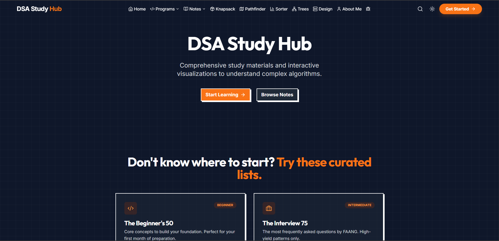
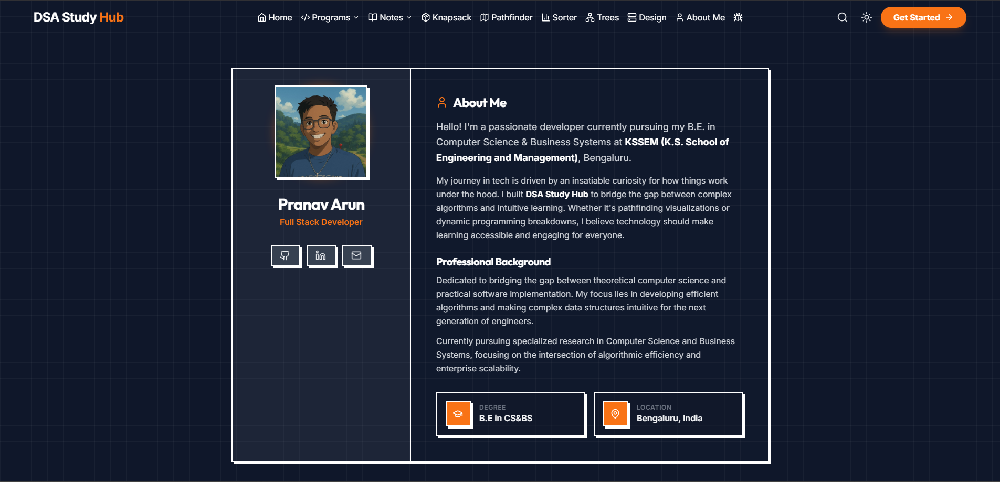
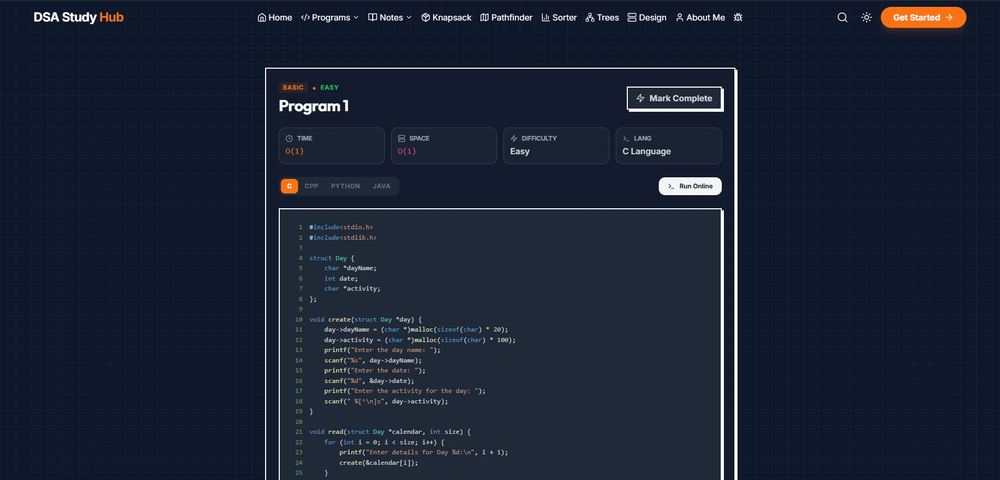
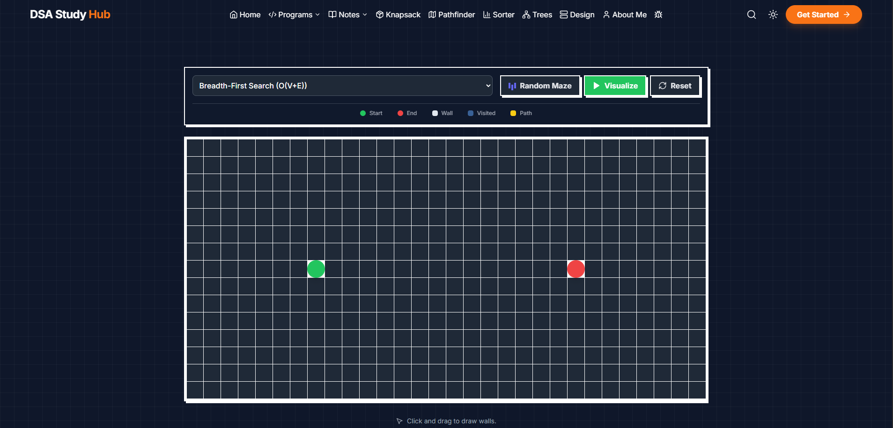
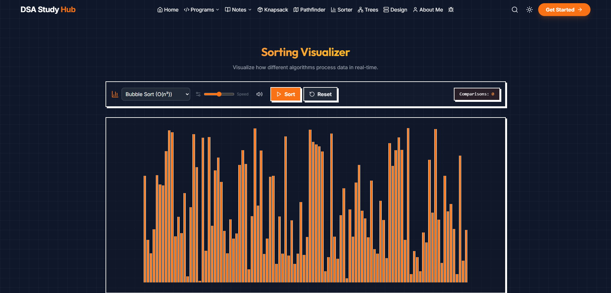
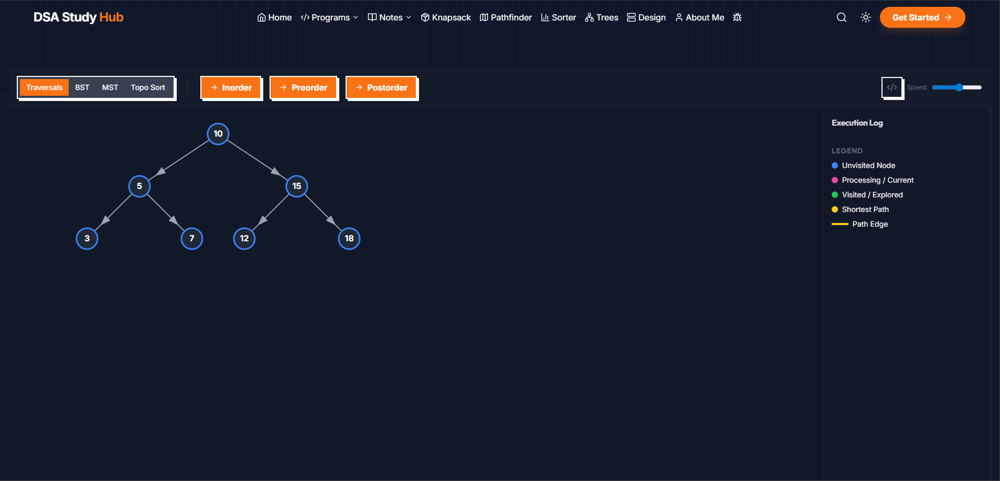
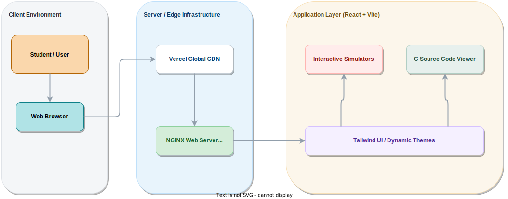
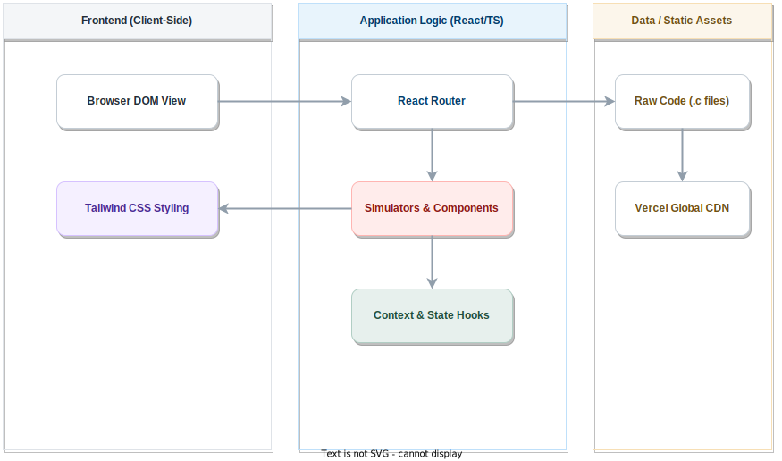
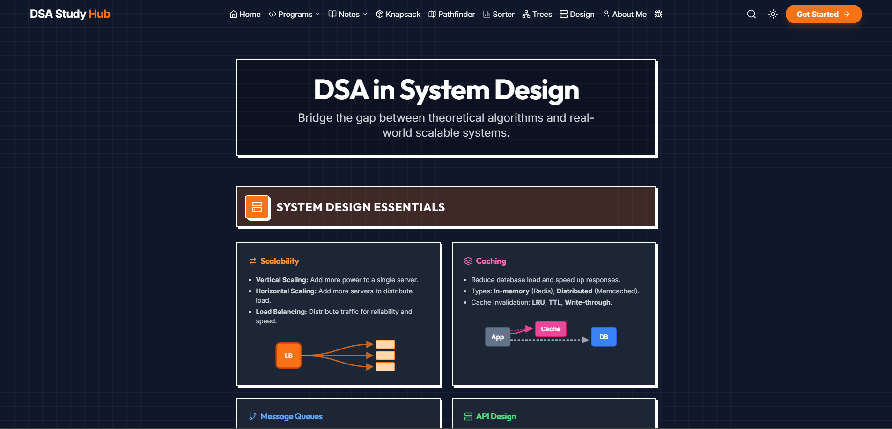

# DSA Study Hub

**Live Demo:** [https://dsa-study-hub.vercel.app](https://dsa-study-hub.vercel.app)

**DSA Study Hub** is an interactive educational web application designed to help students master **Data Structures and Applications (DSA)**. It features a modern, responsive interface where users can view C source code for standard laboratory programs and run interactive simulations of those algorithms directly in the browser.


## Project Previews

### Landing Page



### About Me Section

An integrated portfolio section to showcase My details.


### Interactive Program Simulator

View C code and run simulations (like Stack Operations) instantly.


### Path Finder Visualizer

Interactive Path Finder


### Sorter Visualizer

Interactive Sorting Algorithms Visualization


### Trees & Graphs

Visualizing Tree Traversals and Graph Algorithms


### Architecture Diagrams

#### System Design



#### Full Stack Linkage



### Architecture Overview

System Design and Full Stack Architecture


## Features

- **Interactive Program Simulators:** Visualize and interact with algorithms logic (e.g., Stack operations, Graph traversals) without needing a C compiler.
- **Code Repository:** Access full, copy-ready C source code for 12+ standard DSA programs.
- **Modern UI/UX:**
  - **Dark/Light Mode** toggle for comfortable reading.
  - **Responsive Design** using Tailwind CSS.
  - **Copy-to-Clipboard** functionality for all code snippets.
- **Portfolio Section:** Integrated "About Me" section for instructor/student details.

## Tech Stack

- **Frontend Framework:** [React](https://reactjs.org/) (v18+)
- **Language:** [TypeScript](https://www.typescriptlang.org/)
- **Build Tool:** [Vite](https://vitejs.dev/)
- **Styling:** [Tailwind CSS](https://tailwindcss.com/)
- **Icons:** [Lucide React](https://lucide.dev/)

## Included Programs

The application includes simulations and source code for the following topics:

1. **Weekly Calendar:** Struct usage and dynamic memory allocation.
2. **String Operations:** Pattern matching and replacement.
3. **Stack Operations:** Push, pop, and palindrome check.
4. **Expression Conversion:** Infix to Postfix conversion.
5. **Recursion:**
   - **5A:** Postfix Evaluation.
   - **5B:** Tower of Hanoi.
6. **Circular Queue:** Array-based implementation.
7. **Singly Linked List (SLL):** Student data management.
8. **Doubly Linked List (DLL):** _(Placeholder)_.
9. **Polynomials:** Addition and evaluation using Linked Lists.
10. **Binary Search Tree (BST):** Creation, traversal (Inorder/Preorder/Postorder), and search.
11. **Graph Algorithms:** BFS (Breadth-First Search) and DFS (Depth-First Search).
12. **Hashing:** Hash table implementation with linear probing.

## Getting Started

Follow these steps to run the project locally on your machine.

### Prerequisites

- [Node.js](https://nodejs.org/) (v16 or higher)
- npm (Node Package Manager)

### Installation

1. **Clone the repository:**

   ```bash
   git clone [https://github.com/yourusername/dsa-study-hub.git](https://github.com/yourusername/dsa-study-hub.git)
   cd dsa-study-hub
   ```

2. **Install dependencies:**

   ```bash
   npm install
   ```

3. **Run the development server:**

   ```bash
   npm run dev
   ```

4. **Open in Browser:**
   Click the link shown in the terminal (usually `http://localhost:5173`) to view the app.

## Future Enhancements

We have exciting plans to enhance DSA Study Hub with the following features:

### What we have Learnt So Far

Our development journey with **DSA Study Hub** has been a rich learning experience, blending core algorithmics with modern full-stack practices. Here are the key technical insights and breakthroughs we've achieved:

- **Hardened Security Middleware:** Learned to implement custom Next.js middleware to patch critical security vulnerabilities (such as CVE #16, #17, and #19) related to request smuggling and CSRF bypasses.
- **Safe Multi-Language Code Execution:** Developed a secure server-side sandbox to compile and execute arbitrary user-submitted code (C, C++, Java, Python). This involved managing temporary file environments and handling `child_process` spawns with strict timeout and resource limits.
- **Full-Stack Orchestration:** Mastered the integration of a **Next.js** (Pages Router) frontend with a persistent **Express/MongoDB** backend, utilizing **JWT-based** session management and **CSRF-seeding** for enhanced security.
- **Interactive Algorithm Logic:** Transformed complex, static C-language data structures into dynamic, state-driven **React/TypeScript** visualizers (including Sorting, Pathfinding, Knapsack, and Tree/Graph traversal).
- **Synergistic Visual Documentation:** Adopted a "Documentation-as-Code" approach by integrating **.drawio.svg** diagrams directly into the repository, ensuring system designs evolve alongside implementation.
- **Automated Developer Storytelling:** Leveraged GitHub Metrics to showcase project impact and technical proficiency, overcoming SVG rendering challenges through streamlined workflow optimization.

---

## Contributing

Contributions are welcome! If you have better C code examples or want to improve the simulations:

1. Fork the Project.
2. Create your Feature Branch (`git checkout -b feature/AmazingFeature`).
3. Commit your Changes (`git commit -m 'Add some AmazingFeature'`).
4. Push to the Branch (`git push origin feature/AmazingFeature`).
5. Open a Pull Request.

## License

This project is licensed under the GPL License - see the [GPL LICENSE](LICENSE) file for details.

---
